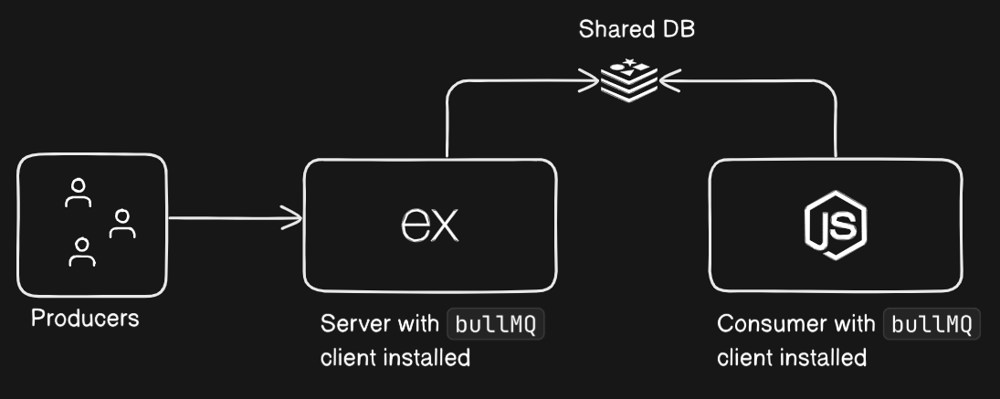

# BullMQ

BullMQ is the fast and robust queue system built on top of **Redis** for Node.js. It is a rewrite of the previous Bull, with a new API and better performance.

---

It is used for handling distributed jobs and messages in any application. It is backed by Redis and it is designed to have a simple and predictable API, and high reliability.

As always without further ado, let's get started with the practical example.

# Prerequisites

- [Bun js](https://bun.sh/) you can also use [NodeJS](https://nodejs.org/en/download/)
- [Redis](https://arshil.vercel.app/blogs/64e0f05241fb439c73098359)
- [TypeScript (optional)](https://www.typescripttutorial.net/)
- [Docker / Podman (optional)](https://docs.docker.com/engine/install/) to run Redis in a container

After installing the above prerequisites, we are good to go.

All source code can be found [here](https://github.com/ArshilHapani/bullMQPractice)

# Architecture of what we are going to build



# Setup Redis (using Docker / Podman)

```bash
docker run -d -p 6379:6379 redis:latest
```

(Without Docker / Podman)

```bash
redis-server
```

# Setup Node.js Project

```bash
npm init -y
# or
yarn init -y
# or
bun init
```

It will create a `package.json` file. Now, let's install the required dependencies.

# Installing required dependencies and devDependencies

```bash
# dependencies
bun install bullmq dotenv express
```

```bash
bun add -D @types/express # typescript is not required with bun
```

> To setup the typescript project follow this (guide)[https://www.digitalocean.com/community/tutorials/setting-up-a-node-project-with-typescript]

# Create `queue.ts` file

```ts
import { Queue } from "bullmq";

export const myQueue = new Queue("firstQueue", {
  connection: {
    url: "redis://localhost:6379", // replace with your redis url
  },
});
```

# Create the basic express app with two routes

code can be found [here](https://github.com/ArshilHapani/bullMQPractice/blob/master/index.ts)

1. Route to view the number of messages in the queue

```typescript
// imports and constants

app.get("/", async (req, res) => {
  const messages = await myQueue.getWaiting();
  const completedJobs = await myQueue.getCompletedCount();
  res.json({
    messages: messages.map((item) => item.data),
    completedJobs,
  });
});
```

2. Route to add a message to the queue

```typescript
app.post("/", async (req, res) => {
  const { message } = req.body;
  if (!message) {
    res.status(400).json({ message: "Message is required" });
    return;
  }
  await myQueue.add(
    "myJob",
    { message },
    {
      // configs... for more info visit https://docs.bullmq.io/guide/queues
      removeOnComplete: true,
    }
  );
  res.json({ message: "Message added to the queue" });
});
```

---

Now every time we hit the post request, the message will be added to the queue and we can view the number of messages in the queue by hitting the get request.
